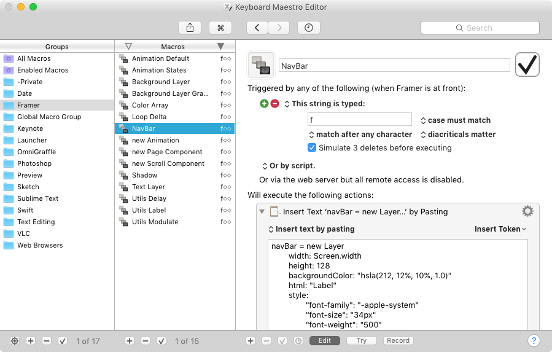
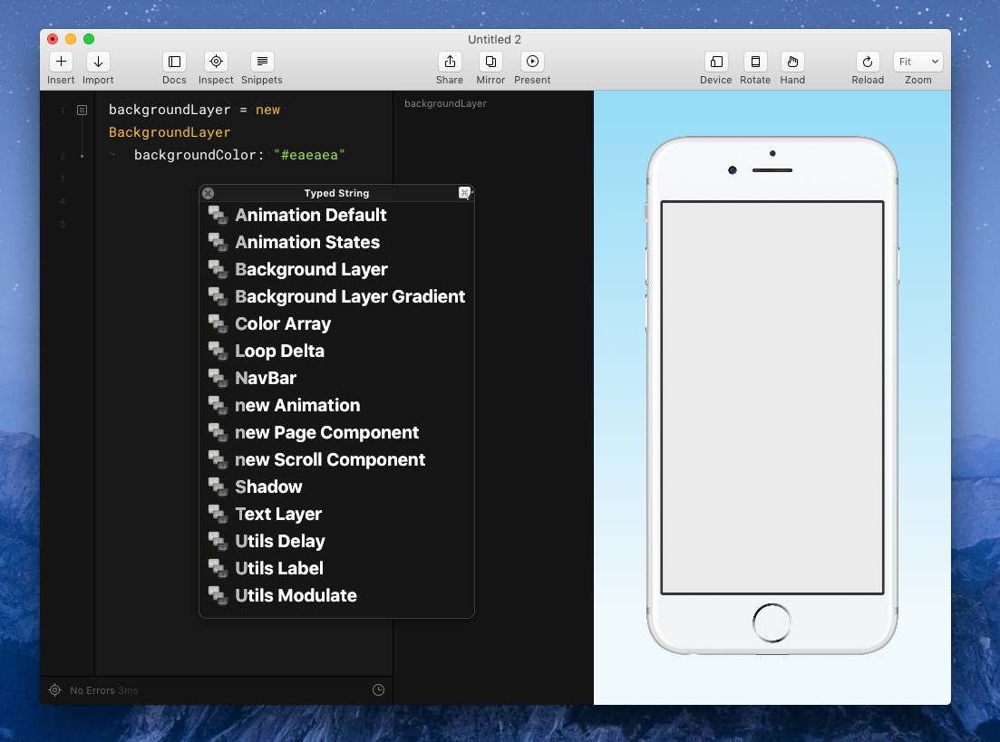
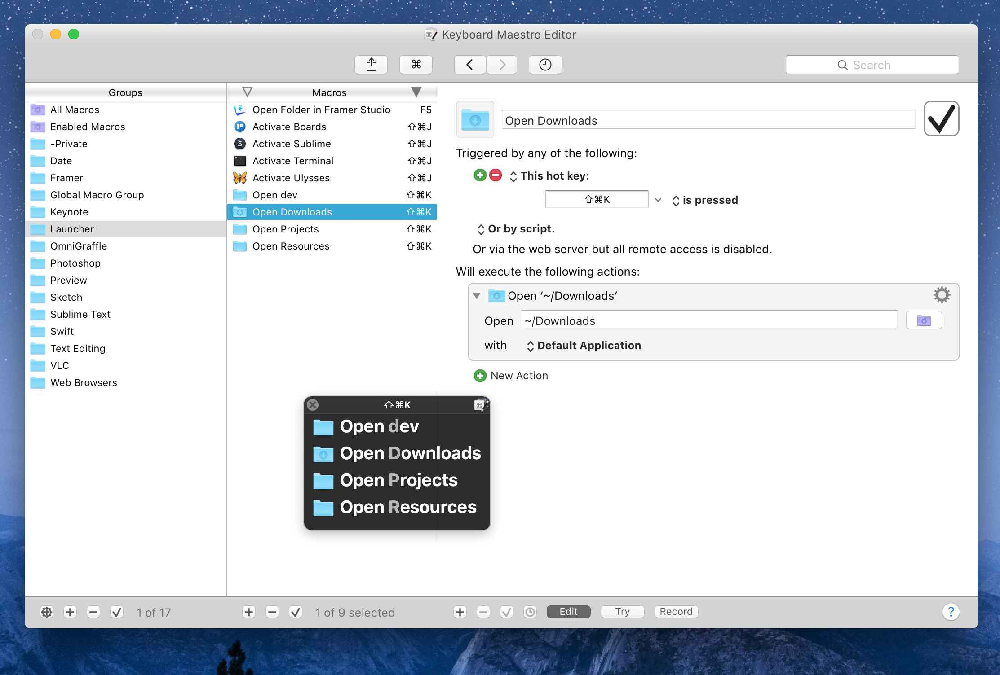

# Keyboard Maestro Macros

I use these Keyboard Maestro macros to map shortcut keys and expand text snippets. What's nice about Keyboard Maestro is that you can export the library and import it to a new machine. I haven't found a way to do that with the built in OS X shortcuts.

## Example Usage

For text snippets, I'll typically map multiple snippets to the same shortcut because Keyboard Maestro has a command palette so you don't have to remember a bunch of unique triggers.

Here, all my Framer snippets are mapped to 'f-space-space'.

In Framer, when I type 'f-space-space' I get this command palette. You can select a snippet with the keyboard by choosing a unique letter (the not very contrasty gray letters).

We can also do a similar thing with apps and folders. I have a launcher group with folders and apps mapped to two different hot keys (CMD + Shift + J & CMD + Shift + K). My most used apps and folders can be activated and opened with a few keystrokes.

